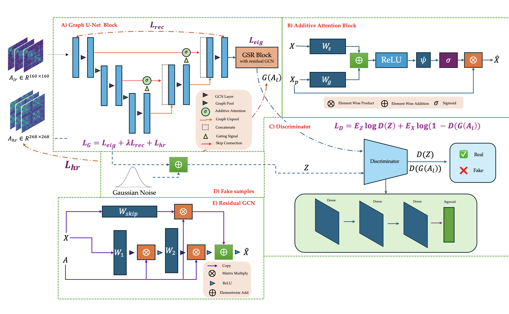
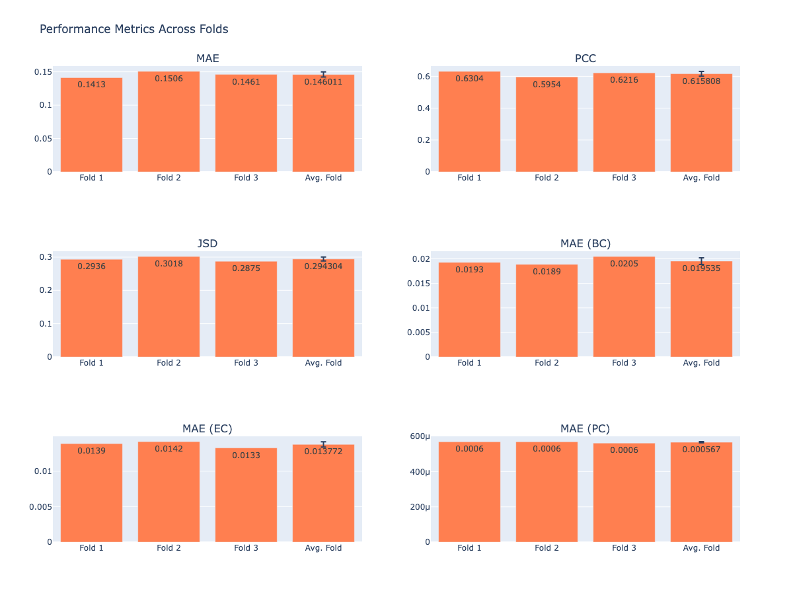

# DGL2024 Brain Graph Super-Resolution Challenge

## Problem Description

We aim to predict high-resolution (HR) brain connectivity
graphs from low-resolution (LR) brain graphs. We leverage
a generative Graph Neural Network (GNN), trained in
an inductive setting, to directly generate high resolution
brain graphs. This helps circumvent the need for heavy,
time-consuming image data processing to shorten the MRI
processing time.

## Name of your model - Methodology

We leverage the adversarial graph super resolution algo-
rithm [1], however we introduce the additive attention mech-
anism [2] to the UNet, similarly to the previously introduced
Attention-UNet [3]. Additionally, we leverage the scaled dot-
product attention mechanism [4] and extend this to graph
neural networks in our graph pooling layer. Our architecture
achieves state of the art results, finishing 8th place in the
DGL Brain Graph Super-Resolution Challenge out of 32
competitors.

## Used External Libraries

In addititon to PyTorch, numpy, sklearn and nx, the only other external library we have used is Plotly, which can be installed via 'pip install plotly'

## Results

## References
[1] M. Isallari and I. Rekik, “Brain graph super-resolution using adversarial
graph neural network with application to functional brain connectivity,”
2021.

[2] D. Bahdanau, K. Cho, and Y. Bengio, “Neural machine translation by
jointly learning to align and translate,” 2016.

[3] O. Oktay, J. Schlemper, L. L. Folgoc, M. C. H. Lee, M. P. Heinrich,
K. Misawa, K. Mori, S. G. McDonagh, N. Y. Hammerla, B. Kainz,
B. Glocker, and D. Rueckert, “Attention u-net: Learning where to look
for the pancreas,” CoRR, vol. abs/1804.03999, 2018. [Online]. Available:
http://arxiv.org/abs/1804.03999

[4] P. Veliˇckovi ́c, G. Cucurull, A. Casanova, A. Romero, P. Li`o, and Y. Ben-
gio, “Graph attention networks,” 2018.

[5] H. Gao and S. Ji, “Graph u-nets,” 2019.
